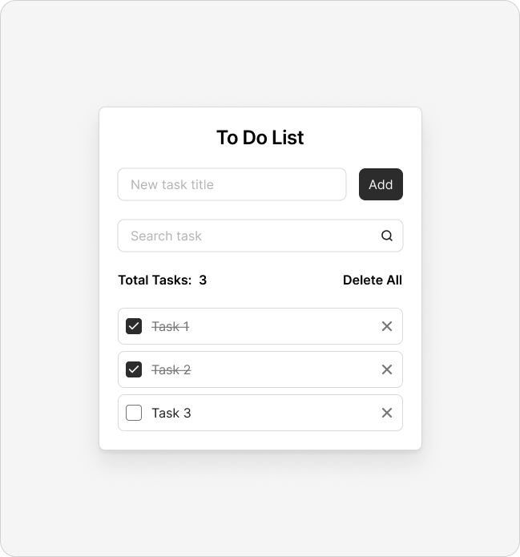

# Todo Vanilla

A lightweight, professional task management application built with pure Vanilla JavaScript, CSS3, and HTML5. This project demonstrates a clean implementation of a CRUD application without external frameworks, focusing on performance, DOM manipulation, and state management.

## Preview



## Features

- **Task Management**: Create, toggle, and delete tasks seamlessly.
- **Search & Filter**: Real-time task filtering to quickly find specific items.
- **Data Persistence**: Automatic synchronization with browser `localStorage` to preserve data across sessions.
- **Bulk Operations**: One-click "Delete All" functionality with user confirmation.
- **Dynamic UI**: Real-time task counter and empty state messaging.
- **Smooth UX**: Integrated disappearing animations for a refined user experience.

## Tech Stack

- **HTML5**: Semantic markup for accessibility and structure.
- **CSS3**: Modern styling using custom properties (variables) and BEM-like naming convention.
- **JavaScript (ES6+)**: Functional programming patterns, DOM API, and LocalStorage integration.
- **Deployment**: Integrated with GitHub Pages for automated hosting.

## Architecture

The project follows a class-based component architecture. The `Todo` class in `main.js` encapsulates the application state, business logic, and DOM interactions. 

- **State Management**: Centralized state object within the class.
- **Rendering**: Data-driven UI updates where the `render()` method synchronizes the DOM with the current state.
- **Event Delegation**: Efficient event handling by binding listeners to container elements.

## Project Structure

```text
src/
├── icons/            # SVG icons used in the application
├── styles/           # Modular CSS structure
│   ├── components/   # Component-specific styles (button, field, todo-item)
│   ├── globals.css   # Global styles and resets
│   ├── main.css      # Main stylesheet entry point
│   └── variables.css # CSS Custom Properties (colors, spacing)
├── index.html        # Main entry point
└── main.js           # Core application logic
```

## Getting Started

### Prerequisites

To run or deploy this project, you need:
- A modern web browser (Chrome, Firefox, Safari, or Edge).
- [Node.js](https://nodejs.org/) (only if you want to use the deployment scripts).

### Installation

1. Clone the repository:
   ```bash
   git clone https://github.com/sabyrzhasul/todo-vanilla.git
   ```
2. Navigate to the project directory:
   ```bash
   cd todo-vanilla
   ```
3. Install dependencies (optional, for deployment tools):
   ```bash
   npm install
   ```

### Development

For local development, you can simply open `src/index.html` in your browser. Alternatively, use a local server like `live-server` for hot-reloading:

```bash
npx live-server src
```

### Deployment

The project is configured to be deployed to GitHub Pages.

To deploy the latest version:
```bash
npm run deploy
```

## Scripts

- `npm run deploy`: Deploys the `src` directory to the `gh-pages` branch.
- `npm test`: Placeholder for future test implementations.

## Contributing

Contributions are welcome. Please follow standard open-source practices:
1. Fork the repository.
2. Create a feature branch.
3. Submit a pull request with a detailed description of your changes.

## License

This project is licensed under the [ISC License](package.json).
